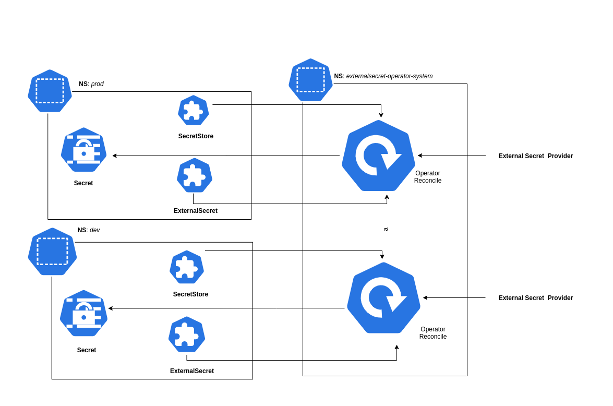

# External Secret Operator

[](https://goreportcard.com/report/github.com/ContainerSolutions/externalsecret-operator) [](https://codecov.io/gh/ContainerSolutions/externalsecret-operator)

This operator reads information from a third party service
like [AWS Secrets Manager](https://aws.amazon.com/secrets-manager/) or [AWS SSM](https://docs.aws.amazon.com/systems-manager/latest/userguide/systems-manager-paramstore.html) and automatically injects the values as [Kubernetes Secrets](https://kubernetes.io/docs/concepts/configuration/secret/).

# Table of Contents

* [Features](#features)
* [Quick start](#quick-start) 
* [Kustomize](#kustomize)
* [What does it do?](#what-does-it-do)
* [Architecture](#architecture)
* [Running Tests](#running-tests)
* [Spec](#spec)
* [Other Supported Backends](#secrets-backends)
* [Contributing](#contributing)


<a name="features"></a>

## Features

- Secrets are refreshed from time to time allowing you to rotate secrets in your providers and still keep everything up to date inside your k8s cluster.
- Change the refresh interval of the secrets to match your needs. You can even make it 10s if you need to debug something (beware of API rate limits).
- For the AWS Backend we support both simple secrets and binfiles.
- You can get speciffic versions of the secrets or just get latest versions of them.
- If you change something in your ExternalSecret CR, the operator will reconcile it (Even if your refresh interval is big).
- AWS Secret Manager, Google Secret Manager and Gitlab backends supported currently!

<a name="quick-start"></a>

## Quick start

<!-- If you want to jump right into action you can deploy the External Secrets Operator using the provided [helm chart](./deployments/helm/externalsecret-operator/README.md) or [manifests](./deploy). The following examples are specific to the AWS Secret Manager backend. -->

<!-- <a name="helm"></a> -->

<!-- ## Helm

Here's how you can deploy the External Secret Operator in the `default`.

```shell
export AWS_ACCESS_KEY_ID="AKIAYOURSECRETKEYID"
export AWS_DEFAULT_REGION="eu-west-1"
export AWS_SECRET_ACCESS_KEY="OoXie5Mai6Qu3fakemeezoo4ahfoo6IHahch0rai"
helm upgrade --install asm1 --wait \
    --set operatorName="asm-example" \
    --set secret.data.Type="asm" \
    --set secret.data.Parameters.accessKeyID="$AWS_ACCESS_KEY_ID" \
    --set secret.data.Parameters.region="$AWS_DEFAULT_REGION" \
    --set secret.data.Parameters.secretAccessKey="$AWS_SECRET_ACCESS_KEY" \
    ./deployments/helm/externalsecret-operator/.
```

It will watch for `ExternalSecrets` with `Backend: asm-example` resources in the `default` namespace and it will inject a corresponding `Secret` with the value retrieved from AWS Secret Manager.
-->

<a name="kustomize"></a>

## Using Kustomize 
#### Install the operator CRDs

- Install CRDs

```
make install
```

<a name="#what-does-it-do"></a>

## What does it do?

Given a secret defined in AWS Secrets Manager:

```shell
% aws secretsmanager create-secret \
  --name=example-externalsecret-key \
  --secret-string='this string is a secret'
```

and updated aws credentials to be used in `config/credentials/kustomization.yaml` with valid AWS credentials:

```yaml
%cat config/credentials/kustomization.yaml
resources:
# - credentials-gsm.yaml
- credentials-asm.yaml
# - credentials-dummy.yaml
# - credentials-gitlab.yaml
```

```yaml
%cat config/credentials/credentials-asm.yaml
...
credentials.json: |-
    {
      "accessKeyID": "AKIA...",
      "secretAccessKey": "cmFuZG9tS2VZb25Eb2Nz...",
      "sessionToken": "" 
    }
```

and an `SecretStore` resource definition like this one:

```yaml
% cat config/samples/store_v1alpha1_secretstore.yaml
apiVersion: store.externalsecret-operator.container-solutions.com/v1alpha1
kind: SecretStore
metadata:
  name: secretstore-sample
spec:
  controller: staging
  store:
    type: asm
    auth: 
      secretRef: 
        name: externalsecret-operator-credentials-asm
    parameters:
      region: eu-west-2
```

and an `ExternalSecret` resource definition like this one:

```yaml
% cat config/samples/secrets_v1alpha1_externalsecret.yaml
apiVersion: secrets.externalsecret-operator.container-solutions.com/v1alpha1
kind: ExternalSecret
metadata:
  name: externalsecret-sample
spec:
  storeRef: 
    name: externalsecret-operator-secretstore-sample
  data:
    - key: example-externalsecret-key
      version: latest
```

The operator fetches the secret from AWS Secrets Manager and injects it as a
secret:

```shell
% make deploy
% kubectl get secret externalsecret-operator-externalsecret-sample -n externalsecret-operator-system \
  -o jsonpath='{.data.example-externalsecret-key}' | base64 -d
this string is a secret
```
<a name="architecture"></a>

## Architecture

In [this article](https://docs.google.com/document/d/1hA6eM0TbRYcsDybiHU4kFYIqkEmDFo5GWNzJ2N398cI) you can find more information about the architecture and design choices. 

Here's a high-level diagram of how things are put together.




<a name="running-tests"></a>

## Running tests

Requirements:

- Golang 1.15 or later
- [Kubebuilder](https://github.com/kubernetes-sigs/kubebuilder) installed at `/usr/local/kubebuilder`

Then just:

```bash
make test
```

<a name="spec"></a>

## CRDs Spec

- See the CRD spec
  - [ExternalSecret](./docs/spec/ExternalSecret.md)
  - [SecretStore](./docs/spec/SecretStore.md)

<a name="secrets-backends"></a>

## Other Supported Backends

We would like to support as many backends as possible and it should be rather easy to write new ones. Currently supported backends are:
| Provider                                                           | Backend Doc                                                        |
|--------------------------------------------------------------------|--------------------------------------------------------------------|
|[AWS Secrets Manager Info](https://aws.amazon.com/secrets-manager/) | [AWS Secrets Manager Backend Docs](#what-does-it-do)               |
|[GCP Secret Manager Info](https://cloud.google.com/secret-manager)  | [GCP Secret Manager Backend Docs](docs/backends/gsm.md)            |
|[Gitlab CI/CD Variables Info](https://docs.gitlab.com/ce/ci/variables/) | [Gitlab CI/CD Variables Backend Docs](docs/backends/gitlab.md) |

<a name="contributing"></a>

## Contributing

Yay! We welcome and encourage contributions to this project! 

See our [contributing document](./CONTRIBUTING.md) and
[Issues](https://github.com/ContainerSolutions/externalsecret-operator/issues) for
planned improvements and additions.
